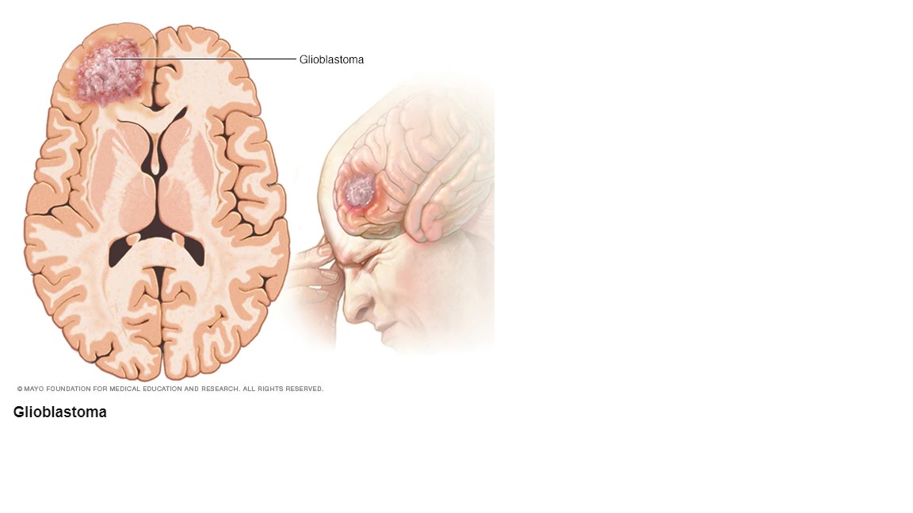

# Brain-Tumor-Segmentation
Brain Tumor Segmentation using CNN

Introduction
A primary brain tumor is a tumor that starts in the brain. Glioblastoma (GBM) is the most common and deadliest primary brain tumors. One-year survival rate of GMB is 34.6% while 5-year survival rate is only 4.75%. GBM has an annual incidence rate of 2-3 per 100,000 adults in the United Sates. Diagnosis of a brain tumor is mainly done by a neurologic exam and analysis of medical images (computed tomography (CT) and/or magnetic resonance imaging (MRI)). 

Source: Mayo Clinic
