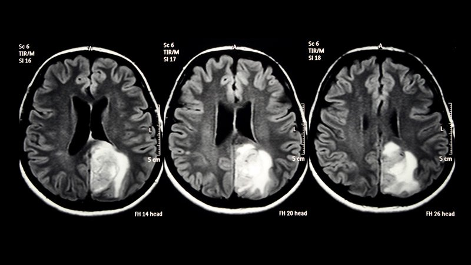

# Brain-Tumor-Detection-Segmentation
Brain Tumor Segmentation using CNN

Introduction
A primary brain tumor is a tumor that starts in the brain. Glioblastoma (GBM) is the most common and deadliest primary brain tumors. One-year survival rate of GMB is 34.6% while 5-year survival rate is only 4.75%. GBM has an annual incidence rate of 2-3 per 100,000 adults in the United Sates. Diagnosis of a brain tumor is mainly done by a neurologic exam and analysis of medical images (computed tomography (CT) and/or magnetic resonance imaging (MRI)). 

 

Source: Mayo Clinic, Medscape

In general, diagnosing a brain tumor usually begins with magnetic resonance imaging (MRI). Once MRI shows that there is a tumor in the brain, the most common way to determine the type of brain tumor is to look at the results from a sample of tissue after a biopsy or surgery. These tests and procedures are described below in more detail.

MRI. An MRI uses magnetic fields, not x-rays, to produce detailed images of the body. MRI can be used to measure the tumor’s size. A special dye called a contrast medium is given before the scan to create a clearer picture. This dye can be injected into a patient’s vein or given as a pill or liquid to swallow. MRIs create more detailed pictures than CT scans (see below) and are the preferred way to diagnose a brain tumor. The MRI may be of the brain, spinal cord, or both, depending on the type of tumor suspected and the likelihood that it will spread in the CNS. There are different types of MRI. The results of a neuro-examination, done by the internist or neurologist, helps determine which type of MRI to use.

Source: https://www.cancer.net/cancer-types/brain-tumor/diagnosis

## Project Steps

1. Tumor detection CNN
2. Tumor segmentation from images.
3. ...Survival Prediction

## DataSets Available: 
1. Brain MRI Images for Brain Tumor Detection (Source: Kaggle Owner: Navoneel Chakrabarty)\
   MRI images from multi source, size 253 images
2. Brats 2019 data set (Multimodal Brain Tumor Segmentation Challenge 2019, Source: BraTS'19, Owner: Upenn)\
   (TCGA-GBM, n=262 and TCGA-LGG, n=199) TCIA scans (135 GBM and 108 LGG)\ 
   All the imaging datasets have been segmented manually

